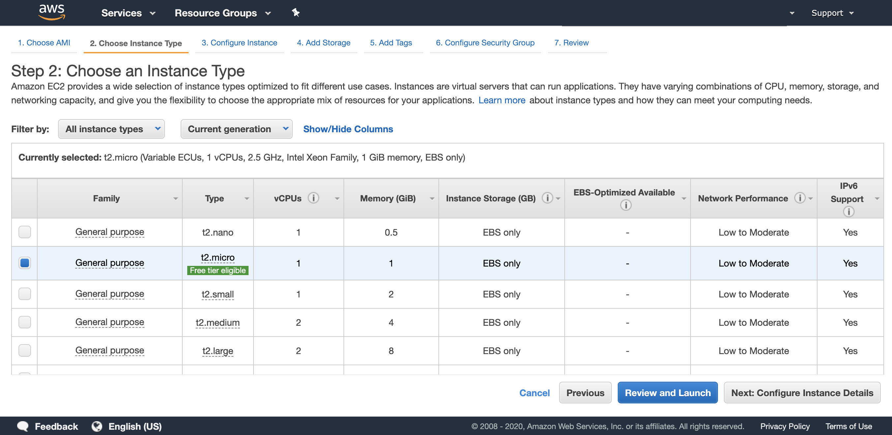
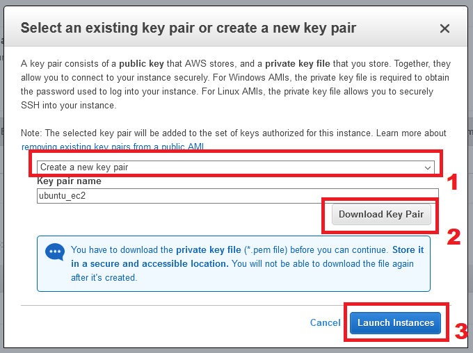
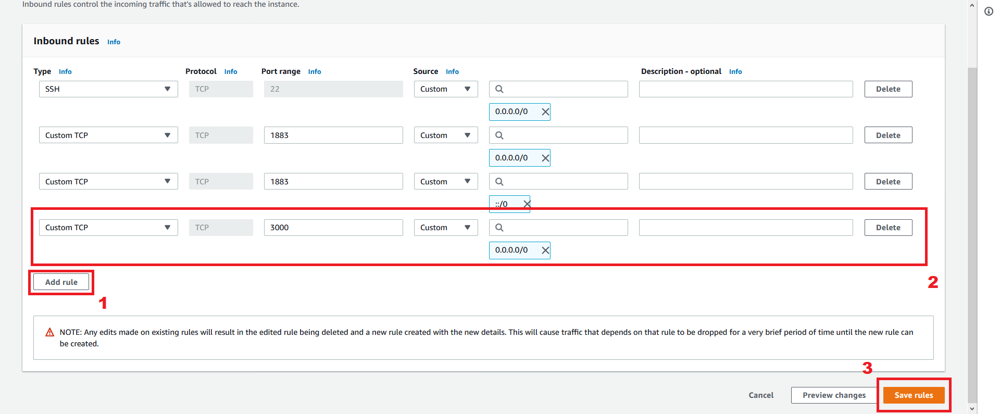

### Table of Contents
- [Launch an Ubuntu EC2 Instance](#launch-an-ubuntu-ec2-instance)
	- [Authorize inbound traffic](#authorize-inbound-traffic)

# Launch an Ubuntu EC2 Instance

This topic describes the steps of launching a new Ubuntu EC2 instance.

1. Open the Amazon EC2 console by choosing EC2 under Compute.

2. From the Amazon EC2 dashboard, choose Launch Instance.

3. Choose the image by using the filter with the value “ubuntu”. Select the Ubuntu Server 18.04 LTS x86.

4. Select the t2.micro instance type.

5. Click Review and Launch.

6. Launch the EC2 instance. Select **Create a new key pair**, set a name and download it in order to connect to the Amazon EC2 instance later on. Then click **Launch Instances**.

## Authorize inbound traffic

To enable network access to your instance, you must allow inbound traffic to your instance. To open a port for inbound traffic, add a rule to a security group that you associated with your instance when you launched it.

1. In the navigation pane of the Amazon EC2 console, choose **Instances**. Select your instance and look at the **Description** tab; **Security groups** lists the security groups that are associated with the instance. Choose **view inbound rules** to display a list of the rules that are in effect for the instance.

2. Open the **Security group** associated.

3. In the details pane, on the **Inbound** tab, choose **Edit**.

4. In the dialog, choose **Add Rule**, and then choose **TCP** from the Type list. Set the port to open and configure a rule source to determine the traffic that can reach the instance.

