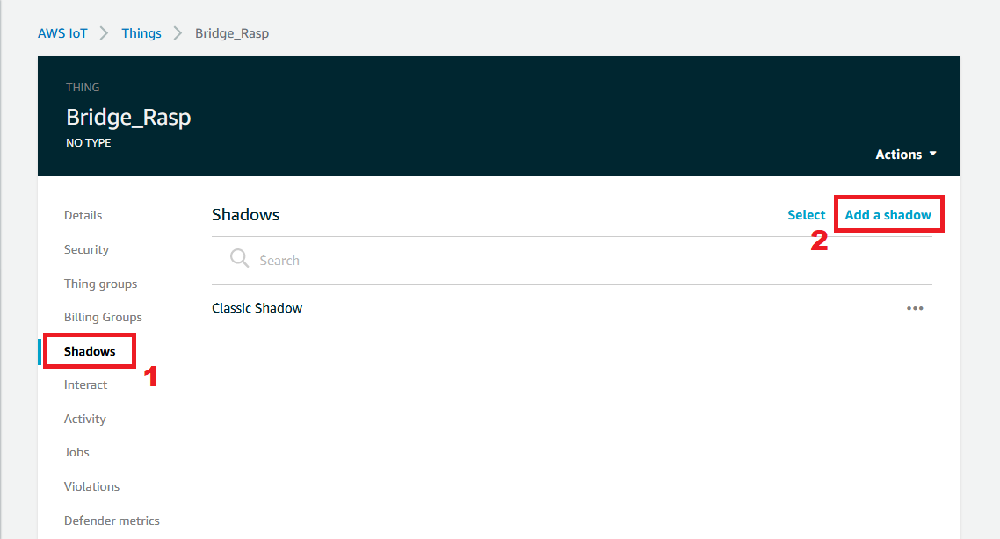

### Table of Contents

- [Adding multiple shadows to an AWS thing](#adding-multiple-shadows-to-an-aws-thing)
  - [Creating a thing](#creating-a-thing)
  - [Adding a shadow](#adding-a-shadow)
  - [Using shadows](#using-shadows)

# Adding multiple shadows to an AWS thing

The feature called named shadow allows you to create multiple shadows for a single IoT device. When a thing is created, a classic shadow is associated with that device but, additionally, multiple "named" shadows can be added to a single thing.

You can store different device state data into different shadows, and as a result access only the required state data when needed and reduce individual shadow size.

Named shadow is metered and charged the same way as the classic shadow are used.

## Creating a thing

Shadows are associated to a device so the first step is to create a new 'thing' in the IoT Core console. The steps to create it are listed in the fololwing link.

* [Create device thing in AWS-IoT](https://telefonicaid.github.io/iot-activation/#/AWS_create_new_thing?id=create-device-thing-in-aws-iot)

## Adding a shadow

1. Go to the 'thing' created and choose Shadows in the left navigation panel. Then click on Add a shadow.

2. Enter the name and click on the Add button.

3. We are going to create two new shadows, 'sensor1' and 'sensor2'.

## Using shadows

Shadows can be named (the created in this tutorial) or unnamed (classic). The topics used by each differ only in the topic prefix. This table shows the topic prefix used by each shadow type.

| ShadowTopicPrefix value | Shadow type
| ---- | --- |
| $aws/things/**thingName**/shadow | Unnamed (classic) shadow
| $aws/things/**thingName**/shadow/name/**shadowName** | Named shadow

